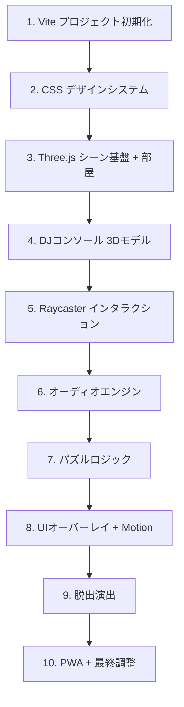

# REBOOT_GATE 実装計画

SF密室脱出ゲーム × DJコンソール × ネオングリッチ。Three.js で描画されたSF実験室内で、DJコンソール型脱出装置の謎を解き、音を重ねてシステムを再起動する。

## User Review Required

> [!IMPORTANT]
> **3Dモデル（GLBファイル）について**: 仕様書では `room.glb` / `console.glb` が記載されていますが、これらの3Dモデルファイルは現在存在しません。本計画では **Three.js のプリミティブ（BoxGeometry, CylinderGeometry 等）を使ってプロシージャルに部屋とコンソールを生成** します。外部3Dモデルを使用したい場合はGLBファイルをご用意ください。

> [!IMPORTANT]
> **音源ファイルについて**: `bgm_loop.mp3` / `bgm_drop.mp3` も存在しません。本計画では **Web Audio API の OscillatorNode + GainNode で合成音源をプロシージャル生成** し、SE/BGMを全てコードで実装します。外部音源を使用したい場合はMP3ファイルをご用意ください。

> [!WARNING]
> **Framer Motion → Motion**: 仕様書では「Framer Motion」と記載されていますが、現在のFramer Motionは **Motion** (`motion` npm パッケージ / motion.dev) にリブランドされ、バニラJS対応済みです。本計画では `motion` パッケージを使用します。

## Open Questions

1. **パズルの難易度・段階数**: 仕様書では「DJコンソールの操作」とありますが、具体的なパズル数（例: 3段階 vs 5段階）の希望はありますか？ → デフォルトは **4段階パズル** で実装します。
2. **モバイル対応の優先度**: 1920x1080基準でスケーリングとありますが、タッチ操作でのDJコンソール操作もフル対応しますか？ → デフォルトは **PC優先、モバイルも基本操作可能** で実装します。

---

## Proposed Changes

### Vite プロジェクト基盤

プロジェクトの初期化とビルド環境の構築。

#### [NEW] package.json
- Vite + Three.js + Motion + vite-plugin-pwa の依存関係
- dev/build/preview スクリプト

#### [NEW] vite.config.js
- VitePWA プラグイン設定（registerType: autoUpdate）
- PWA manifest 定義（アイコン、テーマカラー #050505）
- assetsInclude 設定

#### [NEW] index.html
- エントリーポイント
- Google Fonts (Orbitron) の読み込み
- 3Dキャンバスコンテナ + UIオーバーレイ構造
- `<meta>` SEO タグ

---

### デザインシステム（CSS）

#### [NEW] src/styles.css
ネオン・グリッチの世界観を定義するCSSデザインシステム:
- **カスタムプロパティ**: `--base: #050505`, `--cyan: #00f3ff`, `--magenta: #ff007a`, `--grid: #1a1a1a`
- **グリッチアニメーション**: `@keyframes glitch` — テキストのランダムずれ、色収差
- **ネオングロー**: `text-shadow` / `box-shadow` による発光効果
- **スキャンライン**: `::after` 疑似要素で CRT スキャンラインオーバーレイ
- **UIパネル**: ガラスモーフィズム風の半透明パネル
- **レスポンシブスケーリング**: `aspect-ratio: 16/9` + `object-fit: contain`

---

### Three.js 3Dエンジン

#### [NEW] src/main.js
ゲーム全体のエントリーポイント・メインループ:
- Three.js シーン / カメラ / レンダラー初期化
- `EffectComposer` + `RenderPass` + `UnrealBloomPass` + `OutputPass` のポストプロセシングパイプライン
- `requestAnimationFrame` ゲームループ
- リサイズハンドラ（aspect-ratio 維持）
- 各モジュール（room, console, puzzle, audio, overlay）の統合
- ゲーム状態管理（`INIT` → `PLAYING` → `SOLVED` → `ESCAPED`）

#### [NEW] src/scene/room.js
プロシージャル密室生成:
- `BoxGeometry` で四方の壁・床・天井を生成
- `MeshStandardMaterial` に金属質感（metalness: 0.8, roughness: 0.3）
- 壁面の配線ディテール: `EdgesGeometry` + `LineSegments` でワイヤーフレーム装飾
- ネオンストリップライト: `MeshBasicMaterial`（emissive cyan/magenta）の細いボックスを壁沿いに配置
- `PointLight` / `SpotLight` でムーディな照明
- 床面にグリッドパターン（`GridHelper` + カスタムカラー）

#### [NEW] src/scene/console.js
DJコンソール型脱出装置のプロシージャル生成:
- **本体**: `BoxGeometry` で台座、角を `BufferGeometry` で面取り
- **ターンテーブル**: `CylinderGeometry` × 2 (左右) + 回転アニメーション
- **フェーダー**: `BoxGeometry` の細い棒 × 4 (各パズルステージ対応) — Raycaster でドラッグ操作
- **ボタン**: `SphereGeometry` / `CylinderGeometry` × 複数 — クリックでトグル、発光状態変化
- **波形モニター**: `PlaneGeometry` + `CanvasTexture` にリアルタイム波形描画
- **エミッシブマテリアル**: 操作対象は `MeshStandardMaterial` の `emissiveIntensity` をアニメーション

---

### パズルロジック

#### [NEW] src/logic/puzzle.js
4段階のDJコンソールパズル:
1. **Stage 1 — POWER ON**: コンソール上の電源ボタンを見つけてクリック → システム起動、アンビエントBGM開始
2. **Stage 2 — FREQUENCY MATCH**: 4本のフェーダーを正しい位置にスライド → 周波数パターンが一致すると波形モニターが同期
3. **Stage 3 — BEAT SYNC**: ターンテーブルを正しいBPMで回転させる（クリックタイミング）→ ビートが合うとリズムパートが追加
4. **Stage 4 — DROP TRIGGER**: 全パートが揃った状態で最終ボタンを押す → 脱出シーケンス発動

各ステージの状態管理、ヒントシステム（一定時間操作がないとグリッチテキストでヒント表示）

---

### オーディオエンジン

#### [NEW] src/logic/audio.js
Web Audio API による完全プロシージャル音響:
- **AudioContext** 初期化（ユーザインタラクション後に resume）
- **アンビエントBGM**: 複数の `OscillatorNode`（低周波ドローン）+ `BiquadFilterNode` + `ConvolverNode`（リバーブ）
- **ドロップBGM**: 高速アルペジオ + キックドラム（`OscillatorNode` の周波数スイープ）+ ハイハット（ノイズ + ハイパスフィルタ）
- **SE**: ボタンクリック音、フェーダー移動音、正解音、エラー音
- **AnalyserNode**: FFTデータを毎フレーム取得し、低域（0-200Hz）/ 中域 / 高域に分離
- **オーディオビジュアライザー連携**: 周波数データを `room.js` に渡し、ライト強度・グリッチ強度をリアルタイム変調

---

### UIオーバーレイ

#### [NEW] src/ui/overlay.js
Motion ライブラリによるUI演出:
- **タイトル画面**: "REBOOT_GATE" ロゴ + "CLICK TO START" — グリッチアニメーション付き
- **ステージインジケーター**: 現在のパズルステージ表示（1/4, 2/4...）— spring アニメーションで切り替え
- **ヒントテキスト**: グリッチエフェクト付きテキスト表示
- **脱出演出オーバーレイ**: 白画面フェードイン + "SYSTEM REBOOTED" テキスト
- Motion アニメーション: `initial: { scale: 0.8, opacity: 0 }`, `animate: { scale: 1, opacity: 1 }`, `transition: { type: "spring", stiffness: 300, damping: 20 }`

---

### PWA 対応

#### [NEW] public/manifest.json
- アプリ名、テーマカラー、アイコン定義

#### [NEW] public/ アイコン類
- `generate_image` ツールで PWA アイコン生成（192x192, 512x512）

---

### テクスチャ・アセット

#### [NEW] assets/textures/noise.png
- `generate_image` ツールでグリッチノイズテクスチャ生成

---

## 実装順序

## Verification Plan

### Automated Tests
- `npm run dev` で開発サーバー起動、ブラウザで動作確認
- `npm run build` でプロダクションビルドが成功することを確認

### Manual Verification (Browser)
- ブラウザサブエージェントで以下を確認:
  1. 3D空間が正しく描画される（漆黒の部屋 + ネオンライト）
  2. DJコンソールが表示され、クリック/ドラッグ操作が機能する
  3. オーディオが再生される（ユーザインタラクション後）
  4. パズル4段階が順に解ける
  5. 脱出演出（BloomPass ホワイトアウト）が動作する
  6. UIオーバーレイが正しくアニメーションする
